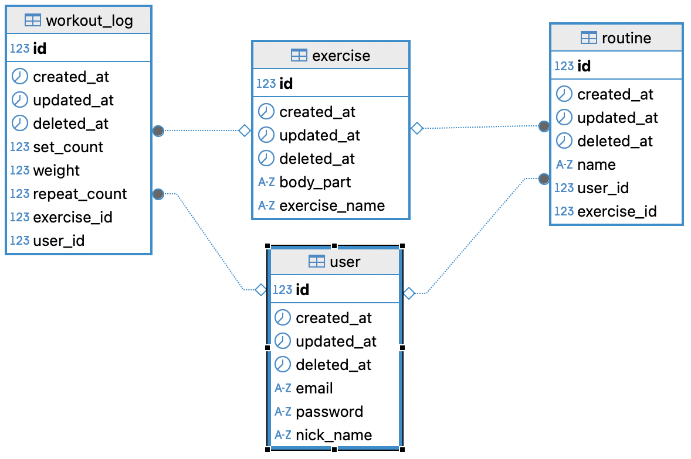

# My Project : A service to log and track your workouts

# Project Stacks

### Backend


### Database & ORM  


### Cache  
 

### Deployment & DevOps 


### Testing 
 


## 🛠️ Tech Stack

### 📦 Backend


### 🗄️ Database & ORM  


### ⚡ Cache  
 

### 🚀 Deployment & DevOps  


### ✅ Testing  


### Tools  


# Project Goals
- Implement a service for logging and tracking gym workout activities
- Create a fully automated CI/CD pipeline to accelerate releases and ensure consistent deployments
- Optimize MySQL performance through
  - Multi‑column indexes
  - Denormalization
  - Redis caching

# Git Flow
master: The main branch for managing release versions

develop: The integration branch where ongoing development takes place

feature: The branch used for developing new features
 

# Features
### CI/CD pipeline built with GitHub Actions, Docker, AWS ECR, and AWS EC2


### MySQL Performance Optimization
I evaluated three strategies:
- Multi‑column indexes, 
- Denormalization
- Redis caching
In the end, **multi‑column indexes + Redis caching** were selcted to acheieve fast query performance while preserving schema flexibilty
 
### Notable API Endpoints

Yearly Exercise Summary (workout-logs/year?)
- Retrieves a breakdown of all exercises performed by a given user in a specified year.

Monthly Exercise Summary(workout-logs/year-month?)
- Retrieves a breakdown of all exercises performed by a given user in a specified month of a specified year.

Top Lift Record Lookup (workout-logs/best)
- Finds the user and details for the heaviest recorded weight for each exercise name.

### Running Tests

# DataBase ERD



 
## Project Structure
```
Gymlog
├── Dockerfile
├── README.md
├── .github/workflows
│   └── deploy.yml
└── src
    ├── auth/
    ├── cache/
    ├── common/
    ├── user/
    ├── exercise/
    ├── routine/
    └── workoutLog/

```


