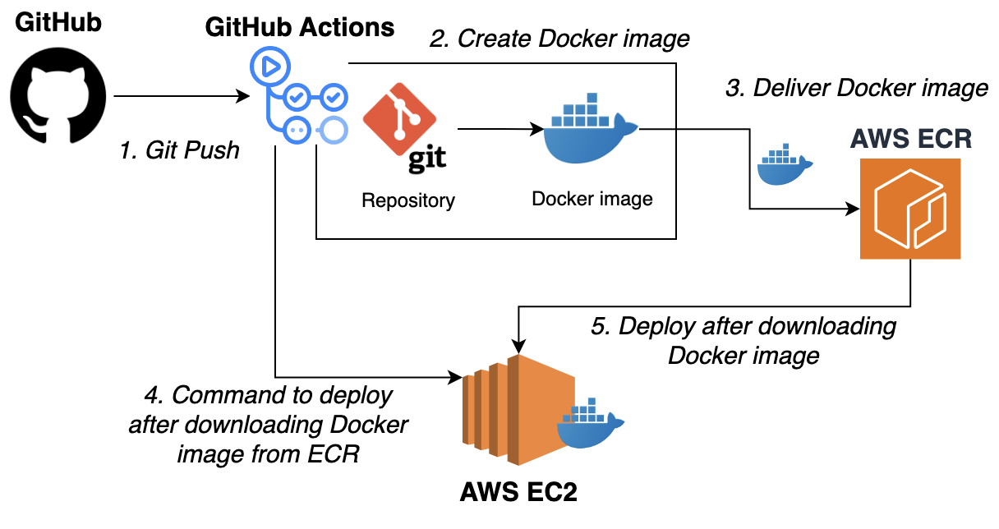

# GymLog: A backend service to log and track gym workouts

## 🛠️ Tech Stack
### 📦 Backend


### 🗄️ Database & ORM  


### ⚡ Cache  


### 🚀 Deployment & DevOps  


### ✅ Testing  


### Tools  


---
## 🎯 Project Goals
- Implement a service for logging and tracking gym workout activities
- Create a fully automated CI/CD pipeline to accelerate releases and ensure consistent deployments
- Optimize MySQL performance through
  - Multi‑column indexes
  - Denormalization
  - Redis caching

---

## ⚙️ Git Flow
- `master`: Main branch for release-ready code  
- `develope`: Integration branch for ongoing development  
- `feature`: Feature development branches
 
---
## ✨ Features
### 🔄️ CI/CD pipeline
CI/CD pipeline built with GitHub Actions, Docker, AWS ECR, and AWS EC2  



### 📈 MySQL Performance Optimization
I evaluated three strategies:
- Multi‑column indexes
- Denormalization
- Redis caching
  
In the end, **multi‑column indexes + Redis caching** were selected to achieve fast query performance while preserving schema flexibilty

### 🔍 Notable API Endpoints

- **Yearly Exercise Summary** (`GET /workout-logs/year?`)  
  Retrieves a breakdown of all exercises performed by a user in a given year.

- **Monthly Exercise Summary** (`GET /workout-logs/year-month?`)  
  Retrieves a breakdown of exercises for a given user in a specific month.

- **Top Lift Record Lookup** (`GET /workout-logs/best`)  
  Finds the user with the heaviest recorded weight per exercise name.

### ✅ Running Tests

Create a `.env.test` file in the root directory with the following content:

```
JWT_SECRET=your_jwt_secret_key     # ← Replace with your actual JWT secret key
DB_HOST=localhost
DB_PORT=3306
DB_NAME=your_database_name         # ← Replace with your actual database name
DB_USERNAME=your_mysql_username    # ← Replace with your actual MySQL username
DB_PASSWORD=your_password          # ← Replace with your actual MySQL password
SALT_ROUNDS=xxx                    # ← Replace with the number of salt rounds to use (e.g., 10)
PORT=3000
HOST_IP=127.0.0.1
JWT_EXPIRESIN=1h
DB_SYNCHRONIZE=false

```

#### E2E tests
```bash
npm run start:e2e
```

#### Layer tests
```bash
npm run start:layer
```

---
## ⛓️ DataBase ERD


---
## 🗂️ Project Structure
```
Gymlog
├── Dockerfile
├── README.md
├── .github/workflows
│   └── deploy.yml
└── src
    ├── auth/
    ├── cache/
    ├── common/
    ├── user/
    ├── exercise/
    ├── routine/
    └── workoutLog/

```