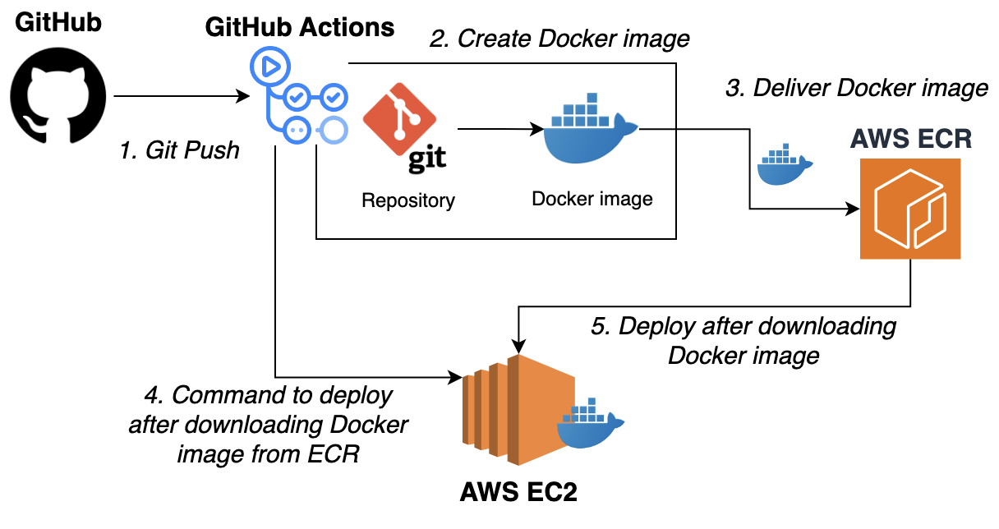
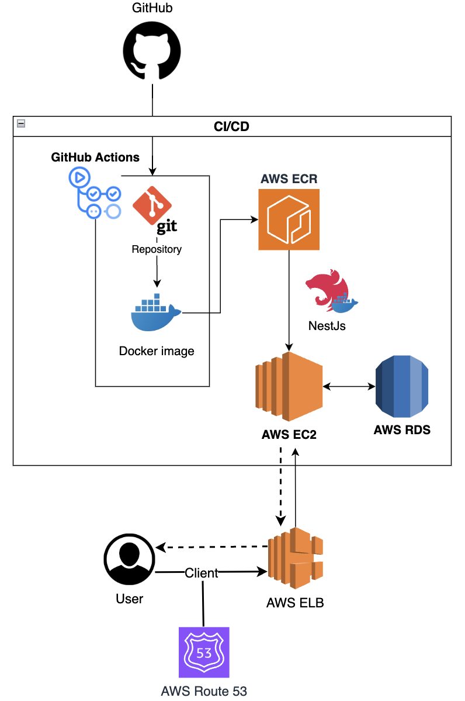
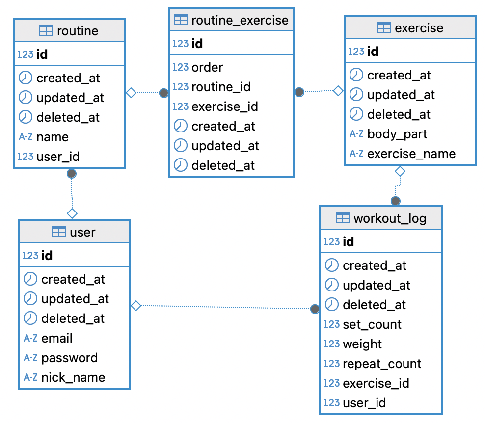

# GymLog: A backend service to log and track gym workouts


## 🏁 About the Project
```
As an entry-level backend developer,
I aimed to build a production-like backend service
while learning and applying real-world technologies and best practices.
```

### 🧩 Key Features
- Designing and implementing Restful APIs
- 📈 MySQL Performance Optimization
- ✅ Running Tests (E2E / Layer Tests)
- Deploying a service on AWS
- 🔄️ CI/CD pipeline
### 🔍 Notable API Endpoints

- **Yearly Exercise Summary** (`GET /workout-logs/year?`)  
  Retrieves a breakdown of all exercises performed by a user in a given year.

- **Monthly Exercise Summary** (`GET /workout-logs/year-month?`)  
  Retrieves a breakdown of exercises for a given user in a specific month.

- **Top Lift Record Lookup** (`GET /workout-logs/best`)  
  Finds the user with the heaviest recorded weight per exercise name.

<hr />

## 🛠️ Tech Stack
#### 📦 Backend: <tb>   

#### 🗄️ Database & ORM:  

#### ⚡ Cache: 

#### 🚀 Deployment & DevOps 
  #### - CI/CD:   
  #### - Infrastructure: -used-FF9900?logo=amazonaws&logoColor=white)


#### 🔎 Testing: 

#### 🧰 Tools:  

<hr />

## ✨Contributions
### 🔄️ Implemented CI/CD pipeline
CI/CD pipeline built with GitHub Actions, Docker, AWS ECR, and AWS EC2  
- Save AWS credentials to GitHub secrets
- Add `deploy.yml` file in `.github/workflows`
- Automatically deploy the service when code is pushed to the main branch on GitHub.



### 📈 MySQL Performance Optimization
#### Evaluated three strategies:
- Multi‑column indexes
- Denormalization
- Redis caching
#### => **`Multi‑column indexes + Redis caching`** were selected to achieve fast query performance while preserving schema flexibility

<hr />

## ☁️ Infrastructure 

### 📜 Infrastructure as Code (CloudFormation)
#### Resources

- **EC2**: Runs the Dockerized NestJS backend
- **RDS (MySQL)**: Stores user, routine, and workout log data
- **ALB (Application Load Balancer)**: Routes public traffic to EC2
- **ECR**: Stores backend Docker images
- **IAM Role**: Allows EC2 to pull images from ECR

####  Parameters

This template is parameterized to provide flexibility when deploying into different environments. 
You will be prompted to enter values such as:

- `KeyName` – EC2 SSH key pair
- `InstanceType`, `VolumeSize` - EC2 compute and storage settings
- `VpcId`, `Subnet1`, `Subnet2` – VPC and subnet IDs in your region
- `DBInstanceIdentifier`, `DBName`, `DBUsername`, `DBPassword` – RDS configuration

#### Deployment Instructions
##### **Template location**
```
template
└── cloudformation-template.yaml
````
##### Deploy via AWS Console
1. Open AWS CloudFormation
2. Choose “Create stack → With new resources (standard)”
3. Upload `cloudformation-template.yaml`
4. Fill in the parameters and deploy

#### Deploy via AWS CLI

```
aws cloudformation deploy \
  --stack-name gymlog-infra \
  --template-file template/cloudformation-template.yaml \
  --capabilities CAPABILITY_NAMED_IAM \
  --parameter-overrides \
    KeyName=my-keypair \
    VpcId=vpc-xxxxxxxx \
    Subnet1=subnet-xxxxx \
    Subnet2=subnet-yyyyy \
    DBInstanceIdentifier=gymlog-db \
    DBNam🏛️e=mydata \
    DBUsername=admin \
    DBPassword=YourSecurePassword \
    InstanceType=t3.micro \
    VolumeSize=20
```
##### ⚠️ Make sure to replace each parameter (e.g., KeyName, VpcId, Subnet1, etc.) with the actual values from your AWS environment before executing the command.

### 🖼️ AWS Infra Architecture


<hr />

## ⚙️ Git Flow
- `master`: Main branch for release-ready code
- `develope`: Integration branch for ongoing development
- `feature`: Feature development branches

<hr />

## ✅ Deploy Instructions

Parameters need to add to GitHub secrets

parameter lists:
- AWS_ACCESS_KEY_ID
- AWS_SECRET_ACCESS_KEY
- EC2_HOST
- EC2_PRIVATE_KEY
- EC2_USERNAME 
- ENV

parameters in ENV
```
JWT_SECRET=your_jwt_secret_key     # ← Replace with your actual JWT secret key
JWT_EXPIRESIN=1h                   # ← Replace with the desired JWT expiration time (e.g., 1h, 30m, 15s)
DB_HOST=AWS_RDS_HOST_ADDRESS       # ← Replace with your actual host ip in AWS RDS 
DB_PORT=3306
DB_NAME=your_database_name         # ← Replace with your actual database name
DB_USERNAME=your_mysql_username    # ← Replace with your actual MySQL username
DB_PASSWORD=your_password          # ← Replace with your actual MySQL password
SALT_ROUNDS=xxx                    # ← Replace with the number of salt rounds to use (e.g., 10)
PORT=80
FE_DOMAIN=https://xxx.com          # ← Replace with actual front-end domain address
```


## ✅ Test Instructions

Create a `.env.test` file in the root directory with the following content:

```
JWT_SECRET=your_jwt_secret_key     # ← Replace with your actual JWT secret key
JWT_EXPIRESIN=1h                   # ← Replace with the desired JWT expiration time (e.g., 1h, 30m, 15s)
DB_HOST=localhost
DB_PORT=3306
DB_NAME=your_database_name         # ← Replace with your actual database name
DB_USERNAME=your_mysql_username    # ← Replace with your actual MySQL username
DB_PASSWORD=your_password          # ← Replace with your actual MySQL password
SALT_ROUNDS=xxx                    # ← Replace with the number of salt rounds to use (e.g., 10)
PORT=3000
HOST_IP=127.0.0.1
DB_SYNCHRONIZE=false

```

#### E2E tests
```bash
npm run start:e2e
```

#### Layer tests
```bash
npm run start:layer
```

<hr />

## ⛓️ DataBase ERD



### Many-to-one relations
- exercise to workout_log
- exercise to routine
- user to workout_log
- user to routine

<hr />

## 🗂️ Project Structure
```
Gymlog
├── Dockerfile
├── README.md
├── .github/
│   └── workflows/
│       └── deploy.yml
├── template/
│   └── cloudformation-template.yml
└── src/
    ├── auth/
    │   └── application/
    ├── cache/
    ├── common/
    │   ├── const/
    │   ├── dto/
    │   ├── infrastructure/
    │   ├── jwtPassport/
    │   ├── logger/
    │   ├── type/
    │   └── validation/
    ├── user/
    ├── exercise/
    ├── routine/
    └── workoutLog/
    │ 
    └── Each domain module (user, exercise, routine, workoutLog) has the same structure
        ├── application/     # service layer (use cases)
        ├── domain/          # domain entities and repository interfaces
        ├── dto/             # data transfer objects
        ├── functions/       # shared business logic utilities
        ├── infrastructure/  # integration with external resources (e.g., DB, Redis)
        ├── presentation/    # controllers (HTTP layer)
        └── test/            # unit and e2e tests

```